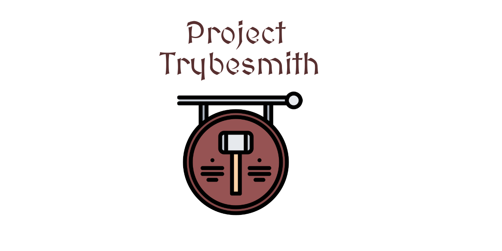
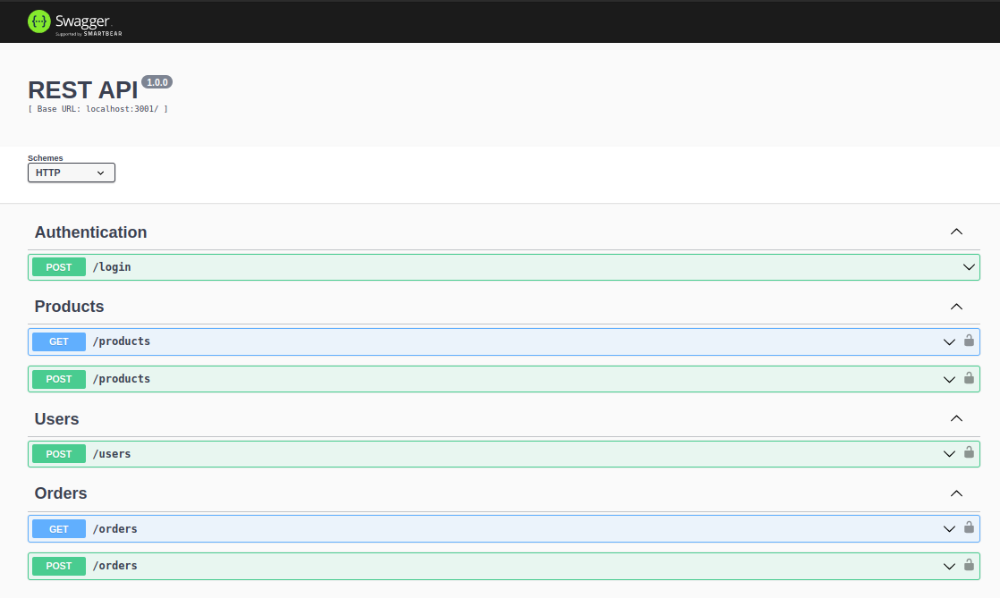

# About

This challenge deals with the development of a Back-end application in Node.js using Express and typescript, applying the principles of Object-Oriented Programming (`OOP`) to build an API with `CRUD` to manage medieval items store. This will be done using the `MySQL` database.

Following `MSC` software architecture (Model - Service - Controller) and `REST` web architecture principles, connecting to a `MySQL` database for information persistence.

# ****Technologies Used****

&nbsp;
&nbsp;
&nbsp;
&nbsp;
&nbsp;
&nbsp;
&nbsp;
&nbsp;
&nbsp;
&nbsp;
&nbsp;

## Entity Relationship Diagram

The project database follows the structure below:

[](https://github.com/tryber/sd-019-c-project-trybesmith/blob/main/images/diagram-der.png)

# Decisions

* For the development of the application, I chose to use `Node.js` technologies, as it is an engine (engine) already based on `JavaScript`, widely supported and with non-blocking IO (using asynchronous methods for stacks), with `Express`, which is a mature framework and tested, which provides various useful abstractions for building `HTTP APIs` in ` Node.js.` This is because they are tools where I have solidified knowledge and domain, thus enabling an agile and safe development of the entire project;
* The choice of typescript was based on the great potential for error detection during project development and the possibility of including the intelligence (IntelliSense) of the IDE.
* The software architecture opt was the `MSC` (Model - Service - Controller) as already mentioned in the introduction, as it is a layered architecture model, which improves the organization and division of responsibilities in `Node.js` applications with `Express`;
* The database chosen for persistence of information was `MySQL`, as it is a `DBMS` - Database Management System - with accessibility reliability and robustness. Being the relational database, which allows the relationship between the tables of all the entities of the code.
* As a tool to ensure code compliance, standardization and quality, I used `ESLint`.

# Usage

## With Docker

> Run the `node` and `db` services with the command `docker-compose up -d`.

* Remember to stop `mysql` if you are using it locally on the default port (`3306`), or adapt if you want to make use of the application in containers
* These services will initialize a container called `trybesmith` and another one called `trybesmith_db`.
* From here you can run the `trybesmith` container via CLI or open it in VS Code.

> Use the command `docker exec -it trybesmith bash`.

* It will give you access to the interactive terminal of the container created by compose, which is running in the background.

> Install dependencies [ **If any** ] with `npm install`

⚠️ Attention ⚠️ If you choose to use Docker, **ALL** the commands available in `package.json` (npm start, npm test, npm run dev, ...) must be executed **INSIDE** the container, that is, in the terminal that appears after executing the `docker exec` command mentioned above.

⚠️ Attention ⚠️ The **git** inside the container is not configured with your credentials. Either do the commits outside the container, or configure your git credentials inside the container.

⚠️ Attention ⚠️ Do not run the npm audit fix command! It updates several project dependencies, and this update conflicts with the evaluator.

⚠️ Attention ⚠️ If you're using macOS and running `docker-compose up -d` you get the following error:

```shell
The Compose file './docker-compose.yml' is invalid because:
Unsupported config option for services.db: 'platform'
Unsupported config option for services.node: 'platform'
```

> 2 possible solutions were found for this problem:
>
> 1. You can manually add the `platform: linux/amd64` option to the database service in the project's docker-compose.yml file, but this is a local solution and you should reproduce this for other projects.
> 2. You can manually add the line `export DOCKER_DEFAULT_PLATFORM=linux/amd64` in your computer's .bashrc, .zshenv or .zshrc files, this is a global solution. The solutions were based on [this source](https://stackoverflow.com/a/69636473).

✨ **Tip:** The `Remote - Containers` extension (which will be in the recommended extensions section of VS Code) is indicated so that you can develop your application in the Docker container directly in VS Code, as you do with your local files .

## No Docker

> Install dependencies [ **If any** ] with `npm install`

⚠️ Attention ⚠️ Do not run the npm audit fix command! It updates several project dependencies, and this update conflicts with the evaluator.

 ✨ **Tip:** To run the project this way, you must have `node` installed on your computer. ✨ **Tip:** The evaluator expects the `node` version used to be 16.

## Documentation

go to `http://localhost/3000/docs`


